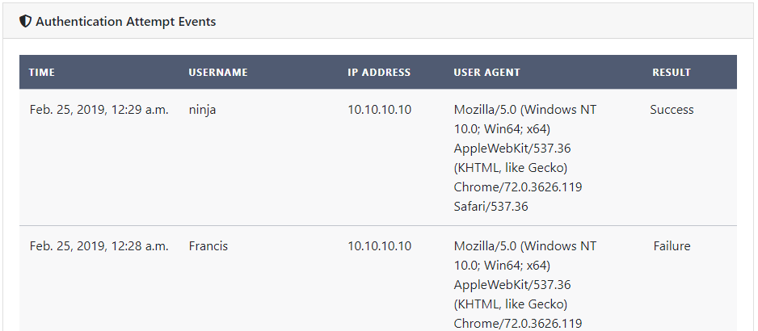

# TLM Ninja login API Coding challenge

My take on the TLM Ninja Coding Challenge 🐱‍👤

## Introduction


This project contains a reusable Django application that logs authentication events to database.
It also provides a fully working project that demonstrates the use of the module.

## Installation in an existing project

* Install the package: `pip install git+https://github.com/francislr/coding-challenge-login-api`
* Add the application to `settings.py`:
    ```
    INSTALLED_APPS = [
        ...
        'therewasanattempt.apps.security_auth_attempt.SecurityAuthAttemptConfig',
    ]
    ```

## Setup development environment

* Create and activate a Python Virtual Environment
* Install dependencies from `requirements.txt`<br>
  `pip install -r requirements.txt`
* Copy `therewasanattempt/settings.py.dist` to `therewasanattempt/settings.py`
* Edit `therewasanattempt/settings.py`
  * By default, the `SECRET_KEY` setting is taken from the `APP_SECRET` environment variable
* Run the usual Django setup commands:
  * `python manage.py migrate`
  * `python manage.py createsuperuser`
* Install frontend dependencies by typing `yarn` or `npm install`
* Build the frontend: `yarn build` or `npm run build`

## Project structure

<dl>
  <dt><i>therewasanattempt/</i></dt>
  <dd>Django project directory</dd>
  <dt><i>static/</i></dt>
  <dd>Frontend Assets</dd>
  <dt><i>deployment/</i></dt>
  <dd>Scripts for deployment with Docker</dd>
</dl>

## API

The project exposes an API endpoint which can be used to retrieve the 30 most recent authentication events.

### Authenticate

For accessing the API, you must get an *AccessToken*.

#### Request
<dl>
  <dt>URL</dt>
  <dd>/api/login</dd>
  <dt>Method</dt>
  <dd>POST</dd>
  <dt>Request Body</dt>
  <dd><code>{<br>
    &nbsp;&nbsp;"username": "{username}",<br>
    &nbsp;&nbsp;"password": "{password}",<br>
  }</code></dd>
</dl>

#### Responses
##### Success
```{
  "token": "{accessToken}"
}
```
##### Error
```
{
    "non_field_errors": "Unable to log in with provided credentials."
}
```


### Last 30 authentication events

Return the last 30 authentication events.
You must supply a valid *AccessToken* 

#### Request
<dl>
  <dt>URL</dt>
  <dd>/api/attempt-event</dd>
  <dt>Method</dt>
  <dd>GET</dd>
  <dt>Request Header</dt>
  <dd><code>Authorization: Token {AccessToken}</code></dd>
</dl>

#### Responses
##### Success
<code>[
&nbsp;&nbsp;&nbsp;&nbsp;{
&nbsp;&nbsp;&nbsp;&nbsp;&nbsp;&nbsp;&nbsp;&nbsp;"time_created": "1970-01-01T00:00:00.215339Z",
&nbsp;&nbsp;&nbsp;&nbsp;&nbsp;&nbsp;&nbsp;&nbsp;"username": "ninja",
&nbsp;&nbsp;&nbsp;&nbsp;&nbsp;&nbsp;&nbsp;&nbsp;"ip_address": "1.1.1.1",
&nbsp;&nbsp;&nbsp;&nbsp;&nbsp;&nbsp;&nbsp;&nbsp;"user_agent": "Mozilla/5.0 (...",
&nbsp;&nbsp;&nbsp;&nbsp;&nbsp;&nbsp;&nbsp;&nbsp;"result": "SUCC"
&nbsp;&nbsp;&nbsp;&nbsp;},
    ...]</code>
</code>
##### Error
<code>{
    &nbsp;&nbsp;"detail": "Authentication credentials were not provided."."
  }</code>
</code>


# The Challenge

Your mission: Create and deploy a `django` application exposing a REST API that will provide details on _login attempts_.
Example details would be IP Address, Region, success and failure attempts count, anything else you think that sounds interesting.

## Requirements

### Backend

- [ ] Expose a REST API
- [ ] Have a way to authenticate with the API
- [ ] Write unit tests to validate API behaviour

### Frontend

- [ ] Have a frontend app, page or django view to login and consume the API
- [ ] List login attempts with details

### The Rules

- [ ] Deployed applicaton must be used on a secure connection (https)
- [ ] Code must be open source
- [ ] There must be a license for the code (of your choice)
- [ ] You must use `git` (you can fork this repo or create a new one)
- [ ] Commit messages should follow [the seven rules of a great Git commit message](https://chris.beams.io/posts/git-commit/)
- [ ] Your project should follow [12 factor](https://12factor.net/) principles

### Deliverable

- [ ] Link to git repository
- [ ] Url to live application
- [ ] Credentials so we can try your application

### Advices

* **Try to design and implement your solution as you would do for real production code.** Show us how you create clean, maintainable code that does awesome stuff. Build something that we'd be happy to contribute to. This is not a programming contest where dirty hacks win the game.
* Feel free to add more features!
* Documentation and maintainability is a plus.
* **Don't you forget those unit tests.**
* We don’t want to know if you can do exactly as asked (or everybody would have the same result). We want to know what you bring to the table when working on a project, what is your secret sauce. More features? Best solution? Thinking outside the box?
* Make sure you apply security good practices. Ninjas hide their secrets because pirates will find them.

